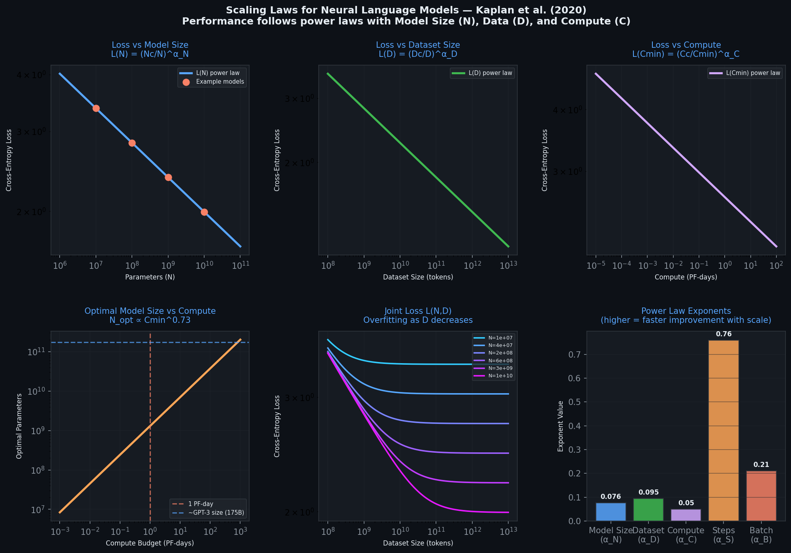
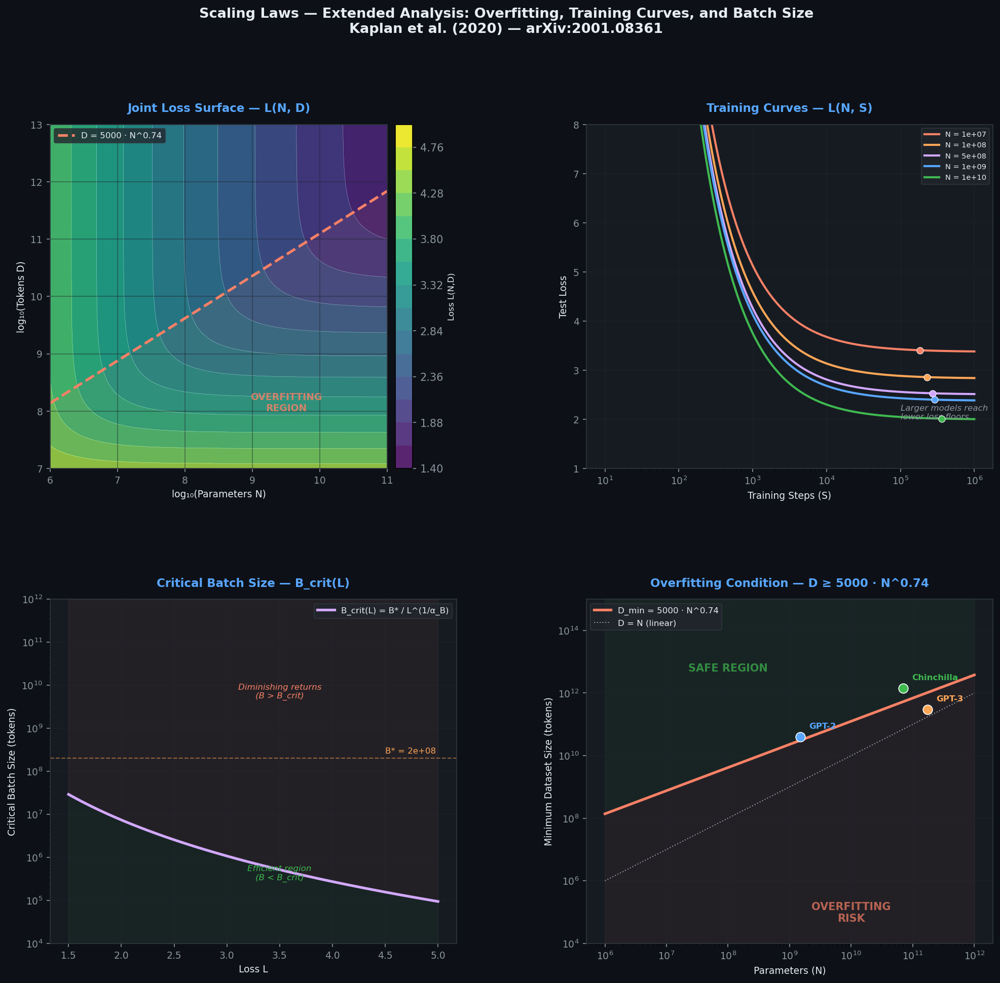

# Scaling Laws for Neural Language Models

**Kaplan, J., McCandlish, S., Henighan, T., Brown, T. B., Chess, B., Child, R., Gray, S., Radford, A., Wu, J., & Amodei, D. (2020)**
*OpenAI — arXiv:2001.08361*

---

## Overview

This paper establishes that the cross-entropy loss of autoregressive Transformer language models obeys **smooth power-law relationships** with three scale factors — model size **N**, dataset size **D**, and training compute **C** — spanning over seven orders of magnitude. Architectural hyperparameters (depth, width, attention heads) have negligible effect once total non-embedding parameter count is held constant.

The central practical finding: **under a fixed compute budget, optimal performance is achieved by training a very large model on a modest amount of data, stopping well before convergence**, rather than training a smaller model to completion. This insight directly informed the design and training strategy of GPT-3 (Brown et al., 2020).

---

## Key Equations

The six power-law relations from Sections 1–6 of the paper are summarized below. All exponents (α) are empirically fitted; scale constants (subscript c) are tokenization-dependent and carry no fundamental meaning.

| # | Relation | Equation | Constants | Reference |
|---|----------|----------|-----------|-----------|
| 1 | Loss vs. parameters | L(N) = (N_c / N)^α_N | α_N = 0.076, N_c = 8.8 × 10¹³ | Eq. 1.1 |
| 2 | Loss vs. data | L(D) = (D_c / D)^α_D | α_D = 0.095, D_c = 5.4 × 10¹³ | Eq. 1.2 |
| 3 | Loss vs. compute | L(C_min) = (C_c / C_min)^α_C | α_C = 0.050, C_c = 3.1 × 10⁸ | Eq. 1.3 |
| 4 | Joint loss (N, D) | L(N, D) = [(N_c/N)^(α_N/α_D) + D_c/D]^α_D | (combines #1, #2) | Eq. 1.5 |
| 5 | Training curve (N, S) | L(N, S) = (N_c/N)^α_N + (S_c/S_min)^α_S | α_S ≈ 0.76, S_c ≈ 2.1 × 10³ | Eq. 1.6 |
| 6 | Critical batch size | B_crit(L) = B* / L^(1/α_B) | B* ≈ 2 × 10⁸, α_B ≈ 0.21 | Eq. 1.4 |

**Optimal compute allocation** (Section 6): given budget C_min, the optimal split is N_opt ∝ C^0.73, B_opt ∝ C^0.24, S_opt ∝ C^0.03 — almost all additional compute should go to larger models, not more training steps.

**Overfitting condition**: to avoid degradation when scaling N, the dataset must satisfy D ≳ 5000 · N^0.74 (sublinear growth).

---

## Architecture Pseudocode

The paper does not introduce a new architecture; it proposes a **predictive scaling framework** for decoder-only Transformers. The pseudocode below formalizes the experimental methodology and the fitted laws.

```
ALGORITHM  ScalingLawFramework
────────────────────────────────────────────────────────────
INPUT
  1.  N  : int          — non-embedding parameters
  2.  D  : int          — dataset size (tokens)
  3.  C  : float        — compute budget (PF-days), C ≈ 6·N·B·S
  4.  S  : int          — number of gradient steps
  5.  B  : int          — batch size (tokens per step)

CONSTANTS  (fitted from WebText2 experiments)
  6.  α_N  = 0.076      — loss exponent for model size
  7.  α_D  = 0.095      — loss exponent for dataset size
  8.  α_C  = 0.050      — loss exponent for compute
  9.  α_S  = 0.76       — loss exponent for training steps
 10.  α_B  = 0.21       — loss exponent for batch size
 11.  N_c  = 8.8×10¹³   — parameter scale constant
 12.  D_c  = 5.4×10¹³   — token scale constant
 13.  C_c  = 3.1×10⁸    — compute scale constant
 14.  S_c  = 2.1×10³    — steps scale constant
 15.  B*   = 2.0×10⁸    — batch size constant

INDIVIDUAL POWER LAWS
 16.  L(N)    ← (N_c / N)^α_N               — convergence loss
 17.  L(D)    ← (D_c / D)^α_D               — data-limited loss
 18.  L(C)    ← (C_c / C)^α_C               — compute-optimal loss

JOINT AND TRAINING-CURVE LAWS
 19.  L(N,D)  ← [(N_c/N)^(α_N/α_D) + D_c/D]^α_D
 20.  L(N,S)  ← (N_c/N)^α_N + (S_c/S_min)^α_S

CRITICAL BATCH SIZE
 21.  B_crit(L) ← B* / L^(1/α_B)

OPTIMAL ALLOCATION  (given budget C_min)
 22.  N_opt  ← k_N · C_min^0.73             — most budget → bigger model
 23.  B_opt  ← k_B · C_min^0.24             — moderate batch growth
 24.  S_opt  ← k_S · C_min^0.03             — steps barely increase

OVERFITTING GUARD
 25.  REQUIRE  D ≥ 5000 · N^0.74

EXPERIMENTAL PROTOCOL
 26.  FOR EACH scale factor X ∈ {N, D, C}:
 27.      FIX the other two factors at non-limiting values
 28.      TRAIN models across 6–8 orders of magnitude of X
 29.      MEASURE cross-entropy loss on WebText2 test set
 30.      FIT power law: L(X) = (X_c / X)^α_X
 31.      VERIFY R² ≥ 0.95 across all scales

ARCHITECTURE UNDER TEST
 32.  Decoder-only Transformer (GPT-2 style, Vaswani et al. 2017)
 33.  Optimizer: Adam (small), Adafactor (>1B params)
 34.  Context length: 1024 tokens
 35.  Dataset: WebText2 (22B tokens, Reddit-filtered web text)
 36.  Model range: 768 parameters → 1.5B parameters
────────────────────────────────────────────────────────────
```

---

## Critical Analysis

### Strengths

- **Massive empirical scope**: hundreds of training runs across eight orders of magnitude yield remarkably clean power-law fits (R² > 0.95), providing a quantitative foundation where only heuristics existed before.
- **Actionable compute allocation**: the optimal-allocation result (§6) gives practitioners a concrete formula for deciding model size given a compute budget.
- **Architecture invariance**: the finding that depth-to-width ratio barely affects loss (at fixed N) simplified model-design decisions across the field.

### Limitations

1. **Chinchilla correction (Hoffmann et al., 2022)**
   Kaplan et al. recommend allocating most compute to larger N with relatively little data. DeepMind's Chinchilla study, using tighter experimental controls, found that **model size and data should scale roughly equally** (N_opt ∝ C^0.50 vs. Kaplan's C^0.73). This correction implies GPT-3 was substantially undertrained for its size and reshaped training strategies for GPT-4, Gemini, and Llama.

2. **Emergent abilities fall outside the framework**
   Smooth power laws predict continuous, gradual improvement. Wei et al. (2022) demonstrated that certain capabilities (multi-step reasoning, chain-of-thought) appear **discontinuously** at specific scale thresholds. Scaling laws as formulated here cannot predict or explain such phase transitions.

3. **No theoretical foundation**
   The authors explicitly compare their results to empirical gas laws before thermodynamics: the fits are excellent, but there is no first-principles explanation for *why* these exponents take the values they do, or under what conditions the laws break down. This limits extrapolation confidence.

4. **Single-architecture limitation**
   All experiments use decoder-only Transformers trained on English web text. Whether the same exponents transfer to encoder-decoder models, mixture-of-experts, state-space models (Mamba), vision transformers, or non-English corpora remains an open empirical question.

5. **Environmental and societal costs unaddressed**
   The paper advocates for ever-larger models but does not quantify or discuss the carbon footprint, energy consumption, or access inequity that follow from its recommendations.

6. **Tokenization-dependent constants**
   The scale constants N_c, D_c, C_c have "no fundamental meaning" (authors' words) and change with vocabulary and tokenization, limiting cross-study comparability.

---

## Impact

**Immediate (2020)**
- Directly motivated **GPT-3** (175B parameters, Brown et al., 2020)
- Gave labs a quantitative roadmap: predictable loss → predictable ROI on compute
- Shifted the training paradigm from "train small to convergence" to "train large, stop early"

**Medium-term (2021–2023)**
- Inspired the **Chinchilla correction** (Hoffmann et al., 2022), which rebalanced data/model scaling
- Established "scaling law" as standard vocabulary in ML research
- Influenced multi-billion-dollar compute investment decisions at OpenAI, Google, and Meta

**Ongoing**
- Scaling laws have been extended to code, multimodal models, reasoning, and reinforcement learning from human feedback (RLHF)
- Efficiency techniques (LoRA, quantization, MoE, distillation) are partly a response to the costs implied by always scaling up
- Whether scaling laws hold indefinitely — or whether architectural innovation is required — remains one of the central debates in AI research

---

## Discussion Questions

**Question 1: Compute allocation and practitioner intuitions**
The paper shows that under a fixed compute budget, optimal performance comes from training a very large model and stopping early — not from training a smaller model to convergence. Why do you think most practitioners *before* this paper followed the opposite strategy, and what experimental or institutional factors made the "train to convergence" approach seem natural?

**Question 2: Empirical laws without theory**
Both Kaplan et al. (2020) and Hoffmann et al. (2022) fit power laws to empirical data on Transformers, yet they reach meaningfully different conclusions about optimal data/model balance. What does this divergence reveal about the reliability of empirical scaling laws in the absence of a theoretical foundation, and how should the field navigate this uncertainty?

---

## Resource Links

1. **Original paper** — [arXiv:2001.08361](https://arxiv.org/abs/2001.08361)
2. **Chinchilla scaling laws** (Hoffmann et al., 2022) — [arXiv:2203.15556](https://arxiv.org/abs/2203.15556)
3. **GPT-3** (Brown et al., 2020) — [arXiv:2005.14165](https://arxiv.org/abs/2005.14165)
4. **Emergent abilities of LLMs** (Wei et al., 2022) — [arXiv:2206.07682](https://arxiv.org/abs/2206.07682)
5. **Scaling data-constrained language models** (Muennighoff et al., 2023) — [arXiv:2305.16264](https://arxiv.org/abs/2305.16264)
6. **Scaling laws for autoregressive generative modeling** (Henighan et al., 2020) — [arXiv:2010.14701](https://arxiv.org/abs/2010.14701)

---

## How to Run

```bash
# Clone and enter the repository
git clone <repo-url>
cd scaling-laws-presentation

# Install dependencies
pip install -r requirements.txt

# Run the core demo (3 power laws + compute frontier)
python scaling_demo.py
# → outputs/scaling_laws_demo.png

# Run the extended analysis (overfitting, training curves, batch size)
python scaling_laws_extended.py
# → outputs/scaling_laws_extended.png
```

Both scripts are self-contained and require only NumPy and Matplotlib (no GPU needed).





---

## Repo Structure

```
scaling-laws-presentation/
├── README.md                    ← This file
├── scaling_demo.py              ← Core power laws + compute frontier (5 plots)
├── scaling_laws_extended.py     ← Advanced results: overfitting, training curves, batch size
├── requirements.txt             ← Python dependencies
├── .gitignore                   ← Standard Python ignores
└── outputs/
    ├── scaling_laws_demo.png    ← Generated by scaling_demo.py
    └── scaling_laws_extended.png← Generated by scaling_laws_extended.py
```

---

## Citation

**BibTeX**
```bibtex
@article{kaplan2020scaling,
  title   = {Scaling Laws for Neural Language Models},
  author  = {Kaplan, Jared and McCandlish, Sam and Henighan, Tom and Brown, Tom B. and Chess, Benjamin and Child, Rewon and Gray, Scott and Radford, Alec and Wu, Jeffrey and Amodei, Dario},
  journal = {arXiv preprint arXiv:2001.08361},
  year    = {2020}
}
```

**APA**
Kaplan, J., McCandlish, S., Henighan, T., Brown, T. B., Chess, B., Child, R., Gray, S., Radford, A., Wu, J., & Amodei, D. (2020). Scaling laws for neural language models. *arXiv preprint arXiv:2001.08361*. https://arxiv.org/abs/2001.08361
